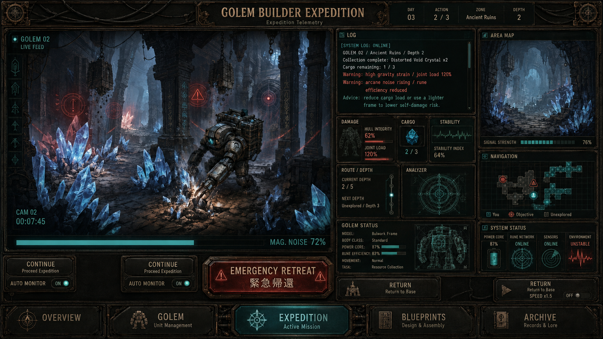

# GOLEM BUILDER EXPEDITION

設計した無機探索構造体を異常区域へ派遣し、損傷原因と回収結果を次の設計へ反映する、遠征特化型のビルドゲームです。

> **Project status:** Playable Alpha / Product Integration
>
> **Release baseline:** `v2.0.0`
>
> **Release ready:** No



## Core loop

```text
DESIGN
→ FABRICATION
→ DEPLOYMENT
→ DAMAGE ASSESSMENT
→ RECOVERY
→ REDESIGN
```

プレイヤーは `FRAME / REACTOR / CONTROL SIGIL` を組み合わせ、`POWER / ARMOR / MOBILITY / WORK` と環境特性を調整します。独立した戦闘モードはなく、面白さの中心は、派遣前の設計判断と派遣後の原因診断です。

## Current product boundaries

- 完成UNITの保有上限は3体です。
- 1日は3 ACTIONです。製造・修理・遠征は各1 ACTION、解体は0 ACTIONです。
- 予測損傷と実際の遠征結果は同じ評価経路を使用します。
- Blueprintは設計記録であり、完成UNITや素材を複製しません。
- `GRAVITY_DEPTH_V0` などの実験は通常セーブと正本ルールから隔離されています。
- Safe Supply、失敗報酬、多段整備、Reserve Hangarは現在の正本には含まれません。

最新の判断は [Current Development Priorities](docs/CURRENT_DEVELOPMENT_PRIORITIES.md) を参照してください。

## Quick start

### Requirements

- Node.js 20 or later
- pnpm 11.19 or later

### Install and run

```bash
pnpm install --frozen-lockfile
pnpm dev
```

Open <http://localhost:3000/>.

No API key or external service is required.

## Available experiences

| Experience | URL | Status |
|---|---|---|
| Canonical MVP | `http://localhost:3000/` | Playable alpha |
| Gravity Depth V0 | `http://localhost:3000/?experiment=GRAVITY_DEPTH_V0` | Isolated vertical slice |
| C UI comprehension | `http://localhost:3000/?experiment=C_UI_COMPREHENSION` | Isolated legacy comparison |

Experimental URLs must not be treated as canonical rule changes.

## Verification

```bash
pnpm lint
pnpm build
pnpm verify:damage
pnpm verify:gravity-depth
pnpm verify:fabrication
```

Deterministic playtest harness:

```bash
pnpm playtest -- --runs=30 --seed=20260812 --max-days=30 --policy=all
```

Static rule audit:

```bash
pnpm audit:rules
```

The canonical baseline currently contains a documented reachable softlock and an Ancient Ruins feasibility failure. `audit:rules` therefore returns a non-zero status when it correctly detects the known baseline condition. This command is diagnostic and is not a green CI gate.

Historical and candidate experiments:

```bash
pnpm experiment:ruins-bodies
pnpm experiment:maintenance
pnpm audit:multi-path-ruins-v1
```

The multi-path ruins candidate is retained as a failed, non-canonical audit result. It is not the next numbered product experiment.

## Documentation map

Start with the [documentation index](docs/README.md).

| Document | Purpose |
|---|---|
| [MVP status and playtest policy](docs/MVP_STATUS_AND_PLAYTEST_POLICY.md) | Canonical phase and test policy |
| [Current development priorities](docs/CURRENT_DEVELOPMENT_PRIORITIES.md) | Current work and hold decisions |
| [World and terminology](docs/WORLD_AND_TERMINOLOGY.md) | Canonical player-facing vocabulary |
| [Gravity Depth V0 specification](docs/experiments/GRAVITY_DEPTH_V0_SPEC.md) | Current isolated vertical slice |
| [Mobile expedition information specification](docs/visual/EXPEDITION_MOBILE_MVP_INFORMATION_SPEC.md) | Expedition telemetry layout contract |
| [Figma design brief](docs/visual/GOLEM_BUILDER_FIGMA_BRIEF.md) | Visual and product handoff |

## Repository structure

```text
src/components/       canonical product UI
src/data/             canonical parts, regions, and outcome rules
src/domain/           shared domain transactions
src/experiments/      isolated experimental slices
scripts/              deterministic verification and audit tools
docs/design/          non-canonical design models and boundaries
docs/experiments/     experiment specifications and results
docs/visual/          information architecture and North Star assets
```

## Contributing and sharing

See [CONTRIBUTING.md](CONTRIBUTING.md) before changing rules, experiments, or terminology. Pull requests should state whether a change is canonical, experimental, or documentation-only and include the relevant verification output.

This repository does not currently declare an open-source license. Public visibility permits viewing and review, but does not by itself grant reuse rights. A license should be selected explicitly by the repository owner before accepting outside redistribution or derivative use.
